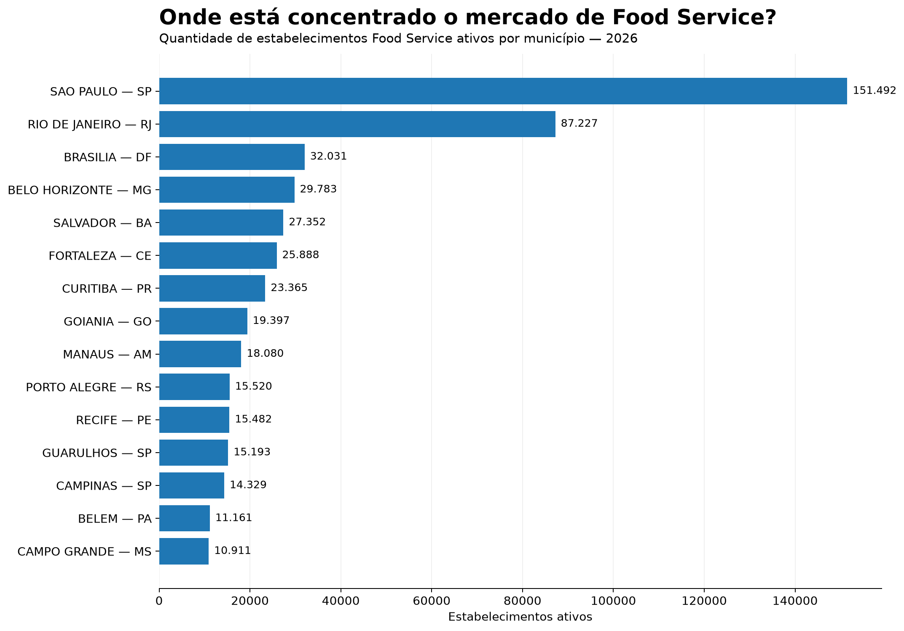
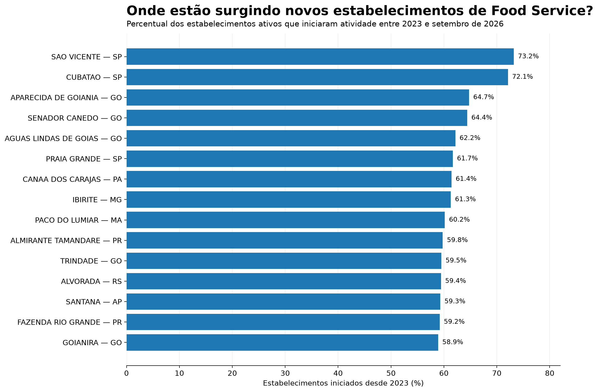
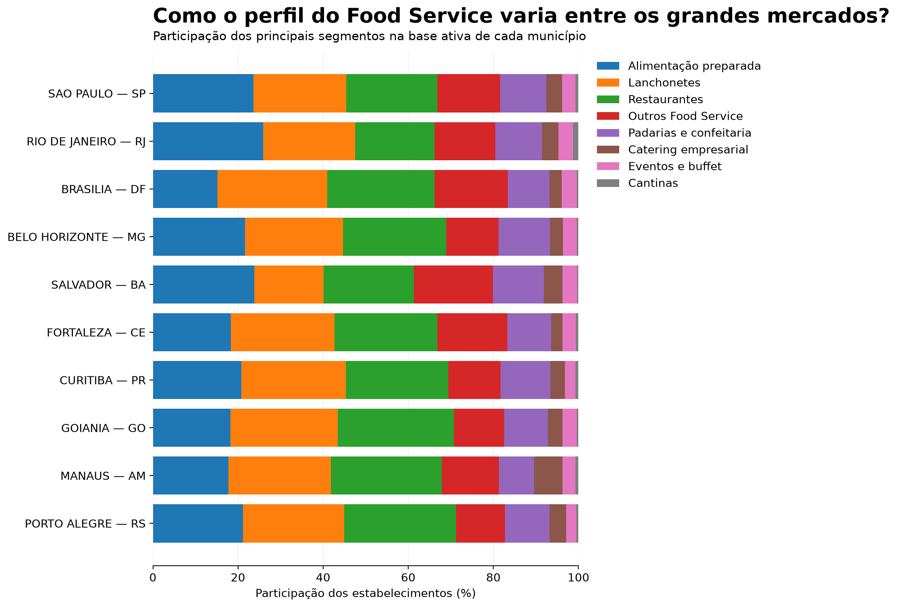
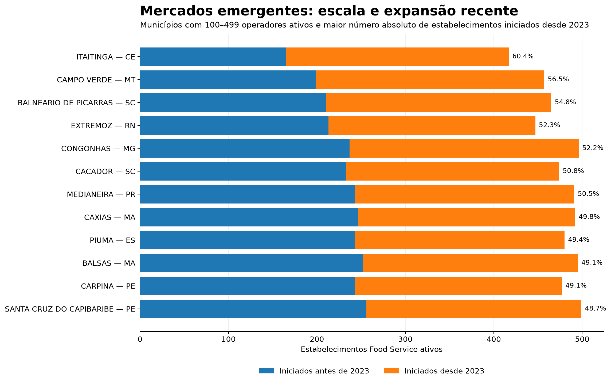
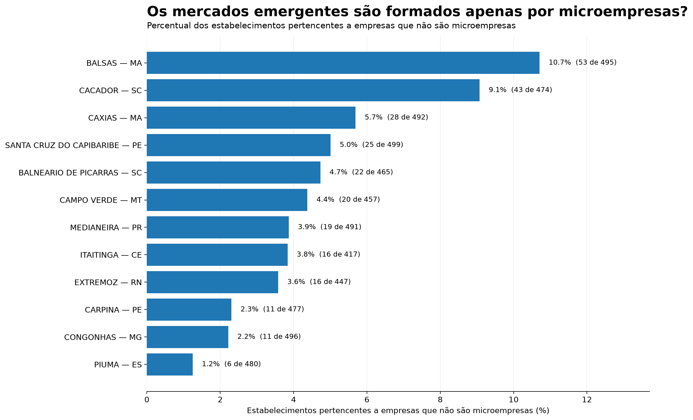

# Food Service Growth Intelligence — Brazil

## Market intelligence para identificar oportunidades de crescimento no Food Service brasileiro

### Visão geral

Este projeto analisa o mercado brasileiro de Food Service a partir de dados públicos de estabelecimentos e população, buscando responder a uma pergunta de negócio:

> **Onde estão os mercados de Food Service com escala relevante, expansão recente e características que justificam uma investigação comercial mais aprofundada?**

A análise combina dados de estabelecimentos, localização, população, segmento de atuação, abertura de empresas e porte empresarial para construir uma visão de mercado em nível municipal.

O objetivo não é criar um ranking definitivo de cidades, mas desenvolver um **framework de inteligência de mercado** que possa apoiar decisões de priorização comercial, desenvolvimento de mercado e expansão no Food Service.

---

## Pergunta de negócio

O Food Service brasileiro é formado por milhares de estabelecimentos distribuídos de maneira heterogênea pelo país.

Para uma empresa que atua nesse mercado, entender apenas o número total de estabelecimentos não é suficiente.

Este projeto busca analisar quatro dimensões:

- **Escala:** onde está concentrado o mercado?
- **Dinâmica:** onde a base de estabelecimentos está se renovando?
- **Perfil:** quais segmentos predominam em cada mercado?
- **Estrutura:** qual é a composição empresarial desses mercados?

A combinação dessas dimensões permite identificar mercados que merecem uma análise comercial mais aprofundada.

---

## Dados utilizados

A análise utiliza fontes públicas.

### Receita Federal — CNPJ

Base pública de estabelecimentos e empresas do Cadastro Nacional da Pessoa Jurídica (CNPJ).

Foram utilizados dados relacionados a:

- situação cadastral;
- atividade econômica (CNAE);
- localização;
- data de início de atividade;
- porte empresarial;
- município.

A partir dos CNAEs, foram identificados estabelecimentos relacionados ao Food Service.

### IBGE

Estimativas populacionais municipais de 2026 foram utilizadas para calcular a densidade de estabelecimentos Food Service por população.

### Integração municipal

Os códigos municipais foram relacionados entre as diferentes bases para permitir a integração entre:

**CNPJ → município → código IBGE → população**

---

# Metodologia

### 1. Identificação do Food Service

Foram selecionados estabelecimentos ativos associados a atividades econômicas relacionadas ao Food Service.

A base final contém:

**1.808.840 estabelecimentos**

distribuídos em:

**5.566 municípios**

### 2. Escala de mercado

Para cada município foi calculado o número de estabelecimentos Food Service ativos.

Esse indicador permite identificar onde existe maior concentração absoluta de operadores.

### 3. Densidade

Foi calculado o número de estabelecimentos Food Service por 100 mil habitantes:

```text
Estabelecimentos Food Service
----------------------------- × 100.000
           População
```

Esse indicador permite comparar mercados de tamanhos populacionais diferentes.

### 4. Dinâmica recente

Foi calculado o percentual de estabelecimentos ativos que iniciaram atividade a partir de 2023:

```text
Estabelecimentos iniciados desde 2023
------------------------------------- × 100
          Estabelecimentos ativos
```

O indicador representa a renovação recente da base de estabelecimentos.

> Os dados de 2026 são parciais, considerando estabelecimentos registrados até setembro de 2026.

### 5. Perfil do mercado

Os estabelecimentos foram classificados em segmentos de Food Service:

- Alimentação preparada
- Lanchonetes
- Restaurantes
- Padarias e confeitaria
- Catering empresarial
- Eventos e buffet
- Cantinas
- Outros Food Service

A participação de cada segmento foi calculada dentro de cada município.

### 6. Estrutura empresarial

A análise também considera o porte das empresas associadas aos estabelecimentos.

As categorias utilizadas são:

- Microempresa
- Empresa de Pequeno Porte
- Demais

Essa dimensão permite entender se determinados mercados emergentes são compostos exclusivamente por microempresas ou apresentam também participação relevante de empresas que não são classificadas como microempresas.

---

# Principais análises

## 1. Onde está concentrado o mercado?

Os maiores mercados municipais concentram uma parcela significativa dos estabelecimentos Food Service brasileiros.



A análise de escala permite identificar onde existe maior concentração absoluta de operadores.

---

## 2. Onde estão surgindo novos estabelecimentos?

Além do tamanho absoluto, é importante observar a renovação da base.



O indicador mostra a participação dos estabelecimentos ativos que iniciaram atividade entre 2023 e setembro de 2026.

Isso permite identificar mercados que, além de possuir escala, apresentam uma base relativamente recente.

---

## 3. O perfil do Food Service é igual em todos os grandes mercados?

Não necessariamente.



A composição por segmento permite observar diferenças entre os principais mercados e entender quais tipos de operadores predominam em cada localidade.

---

## 4. Quais mercados menores apresentam expansão recente?

Para explorar mercados além dos grandes centros, foram selecionados municípios com:

- 100 a 499 estabelecimentos Food Service ativos;
- maior número absoluto de estabelecimentos iniciados desde 2023.



O objetivo dessa análise é encontrar mercados que ainda não possuem a mesma escala dos grandes centros, mas apresentam sinais relevantes de expansão recente.

---

## 5. Esses mercados emergentes são formados apenas por microempresas?

A estrutura empresarial adiciona uma segunda camada à análise.



O percentual apresentado representa a participação dos estabelecimentos pertencentes a empresas que não são classificadas como microempresas.

Esse indicador ajuda a diferenciar mercados com estruturas empresariais distintas.

---

# Principais aprendizados

A análise sugere que oportunidades de mercado não devem ser avaliadas apenas pelo tamanho absoluto.

Uma leitura mais completa combina:

**Escala + dinâmica + perfil + estrutura**

Mercados menores podem apresentar características diferentes dos grandes centros, enquanto mercados de grande escala podem possuir perfis de Food Service bastante distintos entre si.

Essa abordagem permite transformar uma grande base cadastral em uma visão mais direcionada para questões de negócio.

---

# Aplicação para Food Service

Uma aplicação possível desse framework seria apoiar processos como:

- identificação de mercados para prospecção;
- priorização de análises comerciais;
- expansão regional;
- definição de territórios;
- identificação de segmentos com maior presença local;
- desenvolvimento de estratégias específicas por mercado;
- acompanhamento da evolução da base de operadores.

Em um contexto empresarial, os mercados identificados por este estudo poderiam servir como ponto de partida para uma segunda etapa de investigação comercial, incorporando variáveis como potencial de consumo, canais, clientes, concorrência, distribuição e rentabilidade.

---

# Estrutura do projeto

```text
food-service-intelligence/
│
├── README.md
├── requirements.txt
├── .gitignore
│
├── analise_mercado.py
├── analise_food_service.py
├── mercado_analise.csv
│
└── outputs/
    └── graficos/
        ├── 01_top_mercados_escala.png
        ├── 02_escala_dinamica.png
        ├── 03_perfil_segmentos.png
        ├── 04_mercados_emergentes.png
        └── 05_estrutura_mercados_emergentes.png
```

---

# Tecnologias

- Python
- Pandas
- NumPy
- Matplotlib
- OpenPyXL

---

# Como executar

Clone o repositório e instale as dependências:

```bash
pip install -r requirements.txt
```

Execute a análise de mercado:

```bash
python analise_mercado.py
```

Depois gere os gráficos:

```bash
python analise_food_service.py
```

Os resultados serão salvos em:

```text
outputs/
├── mercado_analise.csv
└── graficos/
```

---

# Limitações

Este projeto utiliza dados cadastrais públicos e, portanto, possui algumas limitações:

- O cadastro de CNPJ representa estabelecimentos registrados, não necessariamente toda a atividade econômica efetivamente observada no mercado.
- A classificação de Food Service depende dos CNAEs selecionados.
- Os dados de 2026 são parciais.
- A análise municipal não substitui informações comerciais ou financeiras internas.
- Indicadores de escala e crescimento devem ser interpretados em conjunto com outras variáveis antes de uma decisão comercial.

Por isso, os resultados devem ser entendidos como **inteligência de mercado para direcionar investigação**, e não como uma recomendação comercial definitiva.

---

## Autor

**Afonso Felipe**

Business & Data Analytics  
Python • SQL • Power BI

[GitHub](https://github.com/afonsodata)
